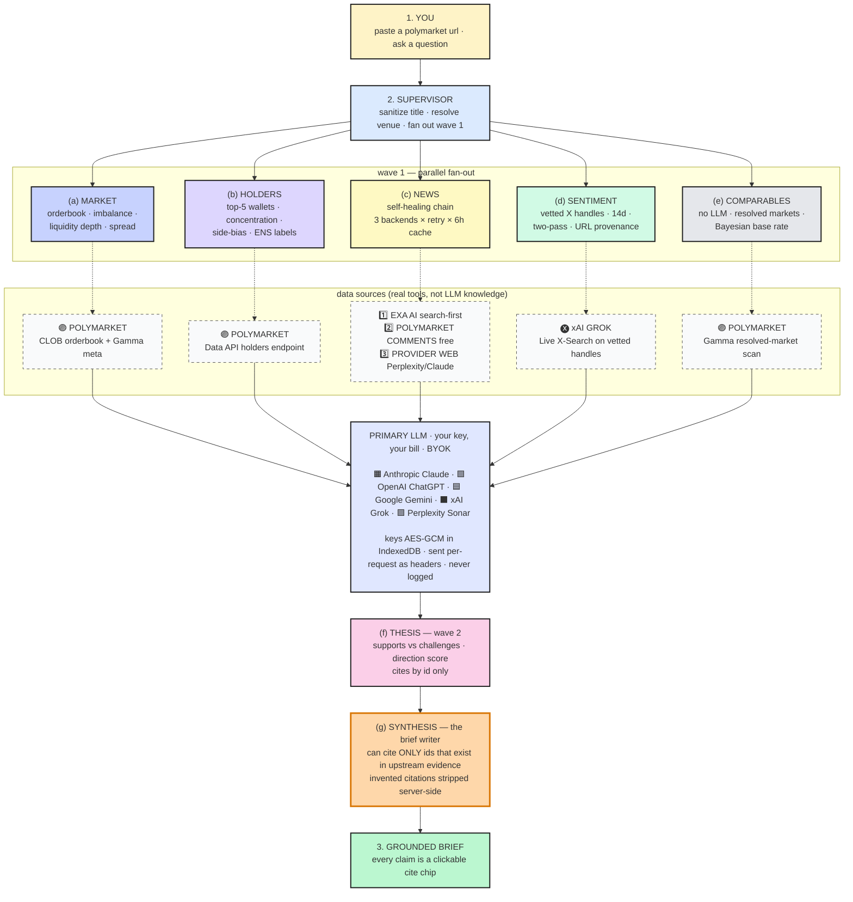

# pmcopilot.wtf — architecture diagrams

## Files

- **[`pmcopilot-architecture.excalidraw`](./pmcopilot-architecture.excalidraw)** —
  the canonical hand-drawn diagram with embedded brand logos. Open at
  [excalidraw.com](https://excalidraw.com) → Menu → Open → select this file.
  Edit, export to PNG/SVG, embed in pitches.
- **[`build.py`](./build.py)** — script that generates the `.excalidraw`
  file. Edit the script + re-run (`python docs/diagrams/build.py`) if you
  want to change the diagram structure; never hand-edit the `.excalidraw`
  JSON.
- This README has a Mermaid mirror that GitHub renders so the diagram is
  readable without opening Excalidraw.

The logos in the file are **base64-embedded SVG badges** (per-vendor color +
single-letter monogram). To swap in real press-kit PNGs:

1. Open at excalidraw.com.
2. Click a logo, hit `delete`.
3. Drag the real PNG onto the canvas in the same spot.

---

## Mermaid mirror (renders on GitHub)

---

## Invariants enforced in code

### 🚫 No fabrication

Every agent that surfaces evidence (URLs, tweets, articles) builds a
**citation registry from a real tool first**, then constrains the LLM to
*reference by index only*. The LLM never emits a primary key (URL, handle,
date) that wasn't already in the registry. Invented IDs in claim text are
stripped server-side before the brief reaches the client.

Sentiment specifically: tweet URLs are only accepted if they exist in
Grok's `citations[]` array from a real `liveSearch: on` call. Pass-2 of
the agent runs `liveSearch: off` against the pre-fetched evidence — the
model literally cannot mint a URL.

### 📰 Source denylist

Wikipedia, Reddit, Substack, Medium, Forbes contributor, Yahoo aggregator
are blocked at the agent boundary (3 layers: Exa pre-filter, news chain
post-filter, agent rendering). Curated allowlist per sub-category surfaces
only trader-grade outlets; off-list survivors get an "unverified" badge.
Global TV networks (CNN/CNBC/NBC/BBC/Sky/Al Jazeera/ESPN) are verified
across every sub-category.

### ♻️ Self-healing news chain

- **Exa AI** first (cheapest, search-first) with 3 attempts × 3 query
  variants × exponential backoff × 429 Retry-After handling.
- **Polymarket event comments** second (free, user-contributed quality
  flagged via `unverified` badge).
- **Provider web search** third (Perplexity Sonar or Claude with
  WebSearch tool — billable, used only when first two come up empty).
- **6h LRU cache** in front of all three: a transient backend failure is
  invisible to any user who saw real data on the same market within 6h.

When all 3 backends genuinely come up empty AND no cache hit, news emits
a diagnostic claim that distinguishes "no backend configured" from "ran
and got nothing" — never a silent empty.

### ✅ Resolved-market short-circuit

When Polymarket reports `closed: true`, the supervisor SKIPS the
sentiment and thesis agents entirely — both produce their worst
hallucinations when there's no real-time data to ground in. News still
runs but searches the 30-day window *before* resolution, not "right now".
A slate-amber banner above the market header signals the brief is a
post-mortem.

### 🔍 Live web for ask

The ask agent (chat panel) also calls **Exa** per question to back-fill
the prompt with last-30-days web sources. Each hit registers as
`[ask-src-N]` in the citation registry; the LLM cites them by index.
Closes the "no live web search in this chat" gap — current-events
questions get fresh sources, not training-data recall.

### 🔒 BYOK key handling

Provider keys never touch the server filesystem or logs:

- Stored in browser IndexedDB encrypted with AES-GCM (non-extractable
  key derived from a per-origin material). Cleared on sign-out.
- Sent per-request as `x-llm-key` / `x-perplexity-key` / `x-xai-key` /
  `x-anthropic-key` / `x-openai-key` / `x-google-key` headers.
- Server middleware reads, threads to the provider routing, then
  discards. No write to disk, no log line containing the header value,
  no inclusion in any cache key (cache keys use a per-process HMAC-SHA256
  digest of the key with a salt that rotates on every server restart).

### 📡 Abort-signal propagation

A client disconnect (browser tab close, navigation away, network drop)
aborts the in-flight chain: route handler → supervisor → agent ctx →
provider.complete fetch. Both brief and ask routes wire `req.on('close')`
into an `AbortController` that chains through every layer down to the
underlying `fetch`. No BYOK quota burned on answers no one is reading.
